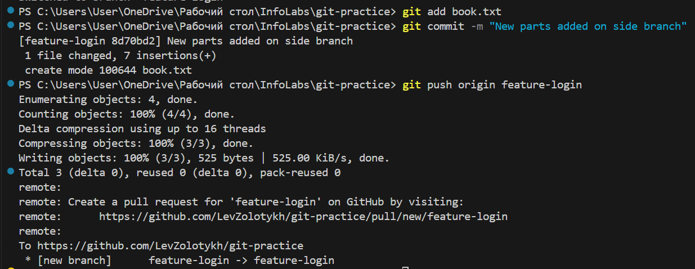

# Отчёт по лабораторной работе №5

## Операции с репозиторием на GitHub

Был создан изначально пустой репозиторий, склонированный на компьютер. Далее на копмьютере был добавлен файл example.txt, представляющий собой начало книги Эриха Марии Ремарка "На западном фронте без перемен"(Рисунок 1), после чего был создан коммит, загруженный в репозиторий GitHib(Рисунок 2):


Рисунок 1


Рисунок 2

Затем была создана новая ветка feature-branch, где "книга" была дописана(добавлено 1 предложение), также был создан коммит(Рисунок 3):


Рисунок 3

После этого было проведено слияние веток(Рисунок 4), вследствие чего содержание файла в ветке main также изменилось(Рисунок 5):

Рисунок 4

Рисунок 5

Далее изменения были отправлены в репозиторий на github.

## Работа с ветками

Был создан файл book.txt, представлявший собой первое предложение книги Теодора Драйзера "Финансист"(Рисунок 6)


После этого была создана новая ветка feature-login(Рисунок 7). В ней файл был дописан(Рисунок 8).


Рисунок 7


Рисунок 8

Далее ветка была добавлена в репозиторий(так как с прошлой части работы в черновой зоне содержался и файл example.txt, он тоже добавился в ветку)(Рисуноки 9 и 10)


Рисунок 9


Рисунок 10

## Работа с удалённым репозиторием

Было выполнено переключение на ветку main, где в файл была добавлена новая глава(Рисунок 11).


Рисунок 11

После этого изменения закоммичены в главную ветку(Рисунок 12):


Рисунок 12

## Моделирование конфликта

После переключения на ветку feature-login вторая глава была переписана (Рисунок 13)


Рисунок 13

Изменения были закоммичены и отправлены(Рисунок 14)


Рисунок 14

## Разрешение конфлитка

При переключении на ветку main возникал конфликт(Рисунок 15):


Рисунок 15

После удаления версии второй главы из ветки main всё прошло успешно(Рисунок 16).


Рисунок 16

## Автоматизация проверки формата файлов при коммите

Требуется написать скрипт, который при попытке коммита будет проверять все изменённые txt файлы на соответствие формату. Скрипт не позволит совершить коммит, если хотя бы ожин файл не соответствует заданному формату (в данной работе форматом будет наличие .txt расширения)

```changed_files=$(git diff --cached --name-only --diff-filter=ACM | grep '\.txt$')

for file in $changed_files; do
  if ! [[ "$file" =~ \.txt$ ]]; then
    echo "Error: file $file does not match the .txt format."
    exit 1
  fi
done

echo "Every file matches format"
exit 0
```
В первом блоке кода реализована выборка txt файлов из изменённых, цикл с условием внутри представляет собой проверку того, что рассматриваемый на итерации файл имеет расширение .txt

Ниже приведены примеры работы (на рисунке 17 коммит файла book.txt, на рисунке 18 коммит самого тестового файла)


Рисунок 17


Рисунок 18

## Использование Git Flow в проекте

В качестве ветки для следуюзего релиза была выбрана первая побочная ветка: feature-branch(Рисунок 19).


Рисунок 19

Далее была создана ветка task-manager, предназначенная для реализации дополнительных функций(в ней реализован файл task-manager.py, предназначенный для дополнительного функционала (Рисунок 20))


Рисунок 20

После этого работу над фичёй закончена и можно слить ветку с веткой для релиза(Рисунок 21):

Рисунок 21

Внутри ветки релиза был создан текстовый файл с версией "проекта"(Рисунок 22):


Рисунок 22

После коммита и окончания релиза происходит мёрдж с главной веткой, а ветка релиза удаляется. После этого мы снова оказываемся в побочной ветке.